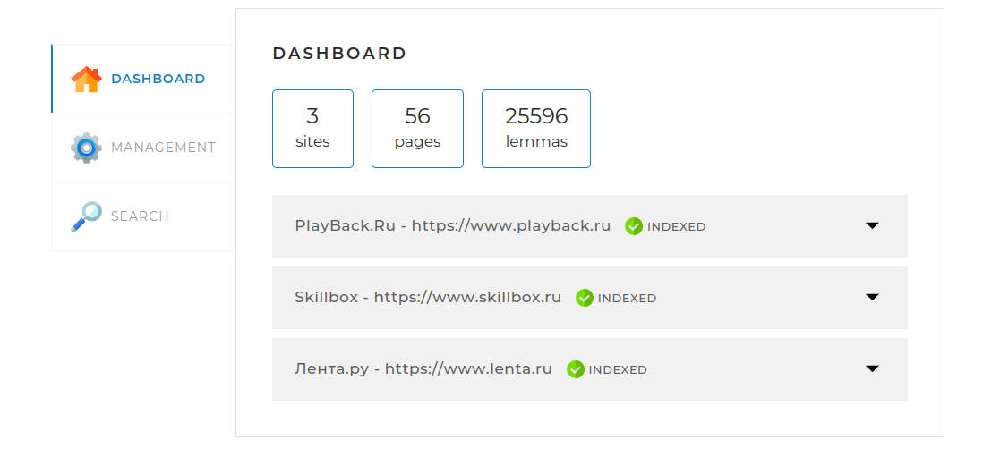
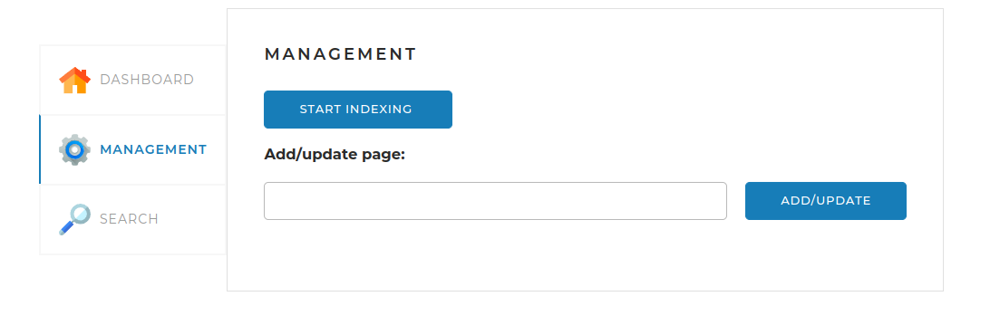
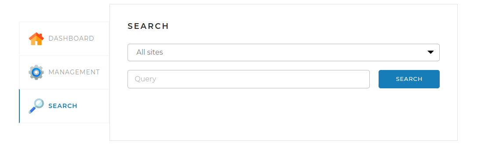

# SearchEngine

SearchEngine - это поисковый движок, который предоставляет пользователю API для выполнения следующих основных функций:

- Предварительная индексация сайтов.
- Выдача основной информации о сайтах.
- Поиск ключевых слов на проиндексированных сайтах и предоставление результатов пользователю.

## Веб-страница

Проект включает веб-страницу, которая предоставляет пользователю интерфейс для управления функциями поискового движка.

### Вкладка DASHBOARD

На этой вкладке отображается общая статистика по всем проиндексированным сайтам, а также детальная статистика и статус по каждому сайту.

### Вкладка MANAGEMENT

Здесь расположены инструменты управления поисковым движком: запуск и остановка индексации, а также возможность добавления или обновления страницы по ссылке.

### Вкладка SEARCH

На этой вкладке пользователь может выполнить поиск по ключевым словам на проиндексированных сайтах.

## Конфигурационный файл приложения - `application.yaml`

### Раздел `server`

В этом разделе задаётся параметр port — порт, через который контроллеры приложения "слушают" веб-запросы.

### Раздел `spring`

Данное приложение по умолчанию работает с СУБД MySQL, работа с другим базами данных типа SQL возможна при изменении соответствующих настроек в файле конфигурации и зависимостей в файле pom.xml.

#### Внимание!

При первом запуске приложения необходимо установить значение `hibernate.ddl-auto` create для автоматической генерации таблиц базы данных на основе классов-сущностей указанных в проекте.

При последующих запусках проекта следует поменять значение данного параметра на update либо none для исключения потерь данных, сохраненных ранее.

### Раздел `indexing-settings`

В данном разделе необходимо указать домены и имена сайтов, для который планируется провести индексацию.

### Раздел `connect-settings`

- `sleepTime` - параметр для увеличения времени между запросами на определенное количество миллисекунд, используется в случае если индексируемый сайт ограничивает доступ для приложения изза слишком частых запросов. 
- `userAgent` и `referrer` - параметры для эмуляцции подключения приложения через браузер. 
- `maxPagesCount` - параметр для примерного ограничения количества страниц индексируемых приложением, при удалении данного параметра ограничение снимается и происходит индексация всех страниц заданных сайтов.

## Запуск программы

Перед запуском программы убедитесь, что выполнены следующие шаги:

1. Установите СУБД и создайте схему базы данных search_engine.
2. Установите параметры `hibernate.ddl-auto`.
3. Установите фреймворк Apache Maven.
4. Укажите токен доступа для Maven-репозитория.

Для указания токена найдите или создайте файл
settings.xml.
- В Windows он располагается в директории
C:/Users/<Имя вашего пользователя>/.m2
- В Linux — в директории
/home/<Имя вашего пользователя>/.m2
- В macOs — по адресу
/Users/<Имя вашего пользователя>/.m2

Если файла settings.xml нет, создайте его и вставьте в него код:

<settings xmlns="http://maven.apache.org/SETTINGS/1.0.0"
xmlns:xsi="http://www.w3.org/2001/XMLSchema-instance"
xsi:schemaLocation="http://maven.apache.org/SETTINGS/1.0.0
https://maven.apache.org/xsd/settings-1.0.0.xsd">

    <settings xmlns="http://maven.apache.org/SETTINGS/1.0.0"
          xmlns:xsi="http://www.w3.org/2001/XMLSchema-instance"
          xsi:schemaLocation="http://maven.apache.org/SETTINGS/1.0.0
                              https://maven.apache.org/xsd/settings-1.0.0.xsd">
        <servers>
            <server>
                <id>skillbox-gitlab</id>
                <configuration>
                    <httpHeaders>
                        <property>
                            <name>Private-Token</name>
                            <value>wtb5axJDFX9Vm_W1Lexg</value>
                        </property>
                    </httpHeaders>
                </configuration>
            </server>
        </servers>
    </settings>

Если у вас возникнет «401 Ошибка Авторизации» при попытке получения зависимостей, возьмите
актуальный токен доступа из документа по ссылке https://docs.google.com/document/d/1rb0ysFBLQltgLTvmh-ebaZfJSI7VwlFlEYT9V5_aPjc/edit.

Обязательно почистите кэш maven. 

Теперь приложение можно компилировать и запускать из программной среды.